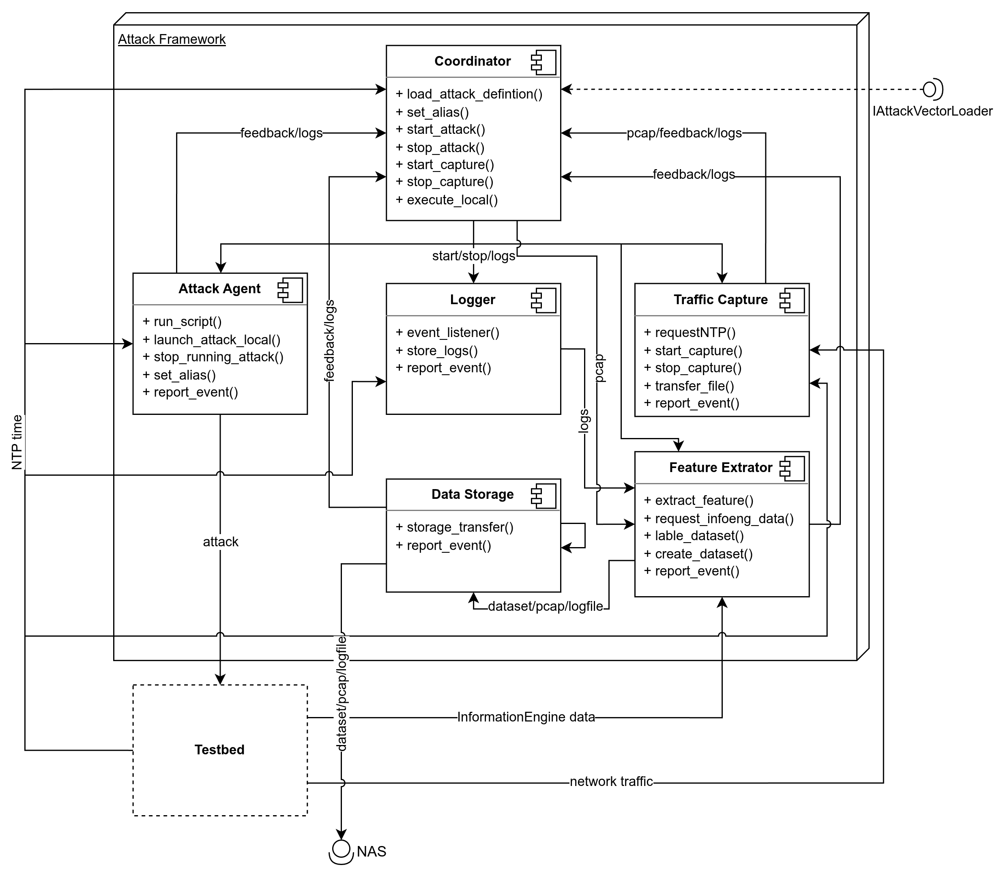
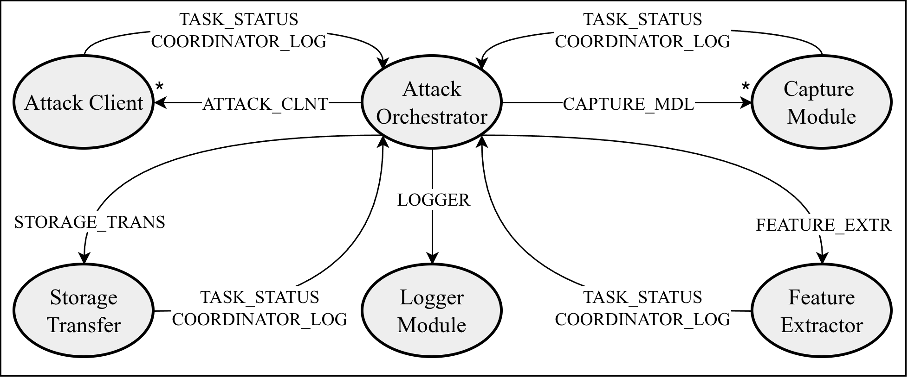

# Attack Framework Code

## Purpose

This framework is used to execute attacks in an OT environment, capture the resulting network traffic and combine that traffic with additional context data from external sources such as the information engine. The goal is to generate datasets that reflect the system state during normal operation as well as during attack execution.

## Components

- `coordinator.py`: central control component. It loads attack definitions, starts and stops attacks, controls capture and triggers feature extraction and storage transfer.
- `attack_client.py`: executes attack scripts on the assigned attack host and reports task status back to the coordinator.
- `capture_module.py`: captures traffic on the selected interface, writes the capture to pcap and transfers it to the coordinator host.
- `feature_extractor.py`: parses the pcap, creates flow-based features, enriches them with external information engine data and writes the dataset.
- `logger.py`: collects log messages from the framework modules and writes them to file.
- `storage_transfer.py`: transfers created datasets and related output files to persistent storage.
- `helper_functions.py`: shared helper functions used by multiple modules.

#### Component Diagram

## Deployment

Python has to be installed on all involved systems.

The intended deployment is split across multiple devices:

- coordinator host: `coordinator.py`, `feature_extractor.py`, `logger.py`, `storage_transfer.py`
- attack host: `attack_client.py`
- capture host: `capture_module.py`

Startup scripts are provided for the different systems in order to activate the virtual environment, install required packages and launch the respective modules. The shared module `helper_functions.py` is required on each machine.

In addition to the framework hosts, the setup may use external systems such as:

- an information engine for additional process or host context
- a NAS or other persistent storage target for generated data

## Usage

After the startup scripts have been executed on the involved machines, the framework is controlled through `coordinator.py`.

The following commands are available:

- `load_ad <FILE>` : loads an attack definition from JSON
- `run_def` : runs the loaded definition
- `set_alias <IPADDR> <ALIAS>` : assigns an alias to a module on the specified IP address
- `execute_local <COMMAND-STRING>` : executes local shell commands on the coordinator host
- `start_attack <ALIAS1,ALIAS2> <INTERPRETER> <LOCAL_PATH>` : starts an attack using a script already available on the attack client
- `start_attack_script <ALIAS1,ALIAS2> <INTERPRETER> </PATH/TO/SCRIPT> <ARG1> <ARG2>` : transfers and starts a script directly on the attack client
- `stop_attack` : stops a running attack
- `start_capture <IFACE>` : starts packet capture on an interface
- `stop_capture` : stops the running capture
- `shutdown` : terminates the coordinator
- `help` : shows the available commands

If the coordinator is started in automatic mode, only attack definitions are executed:

- `python3 coordinator.py --auto_run <PATH/TO/JSON>`

Example definitions are available in `attack_def/test/`.

## Attack Definitions

Attack definitions are stored as JSON files. A definition contains the ordered task list that the coordinator executes. Each task may define:

- an `id`
- a `type`
- optional `targets`
- optional timing information
- a `params` section
- optional `blocking` behavior

Blocking tasks are not followed by the next task until the responsible module has reported `finished` or `error` via task status.

## Data Flow

A typical run looks like this:

1. The coordinator loads and starts an attack definition.
2. The capture module records network traffic on the selected interface.
3. The attack client executes the assigned attack script.
4. After capture is stopped, the pcap is made available to the coordinator host.
5. The feature extractor reads the pcap, groups packets into flows and computes network features.
6. Additional information from the information engine is queried for the same time window and added to the dataset.
7. The resulting dataset, pcap and log output are transferred to persistent storage.

## LCM Communication

The modules communicate via LCM. For this purpose, the required message structs are defined in `msg/` / `exlcm`. Communication is handled over dedicated channels, while the coordinator acts as the central control instance.

By default, the framework uses multicast communication over `239.255.76.67:7667`.

#### LCM Channels

The diagram below shows which modules communicate via which channels.

## Current State

The framework is functional in its basic workflow:

- coordinator control via attack definitions
- attack execution on separate hosts
- remote traffic capture
- feature extraction from transferred pcaps
- logging across modules
- transfer of generated output to persistent storage

Some parts are still being refined, especially around robustness, error handling and completeness of the extracted feature set.

## Main Author

Stefan Haratzmüller, JRC Intelligent and Secure Industrial Automation
